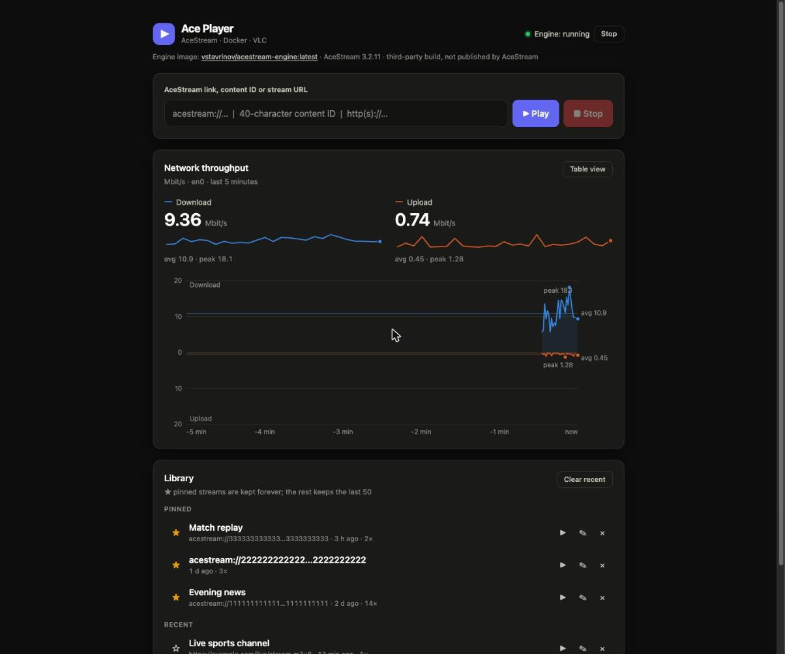

# Ace Player

A small local web app for watching [AceStream](https://www.acestream.org/) streams in VLC on macOS.



- **Paste and play** - an `acestream://` link, a 40-character content ID or any `http(s)` stream URL.
- **Library** - every stream you play is remembered. **Pin** the ones to keep (pinned entries are never
  removed) and **name** them.
- **Starts the engine for you** - runs the AceStream engine in Docker on demand; start/stop it from the page.
- **Stop** playback from the page.
- **Network chart** - live download/upload throughput, mirrored around a zero line, with averages and peaks.

No dependencies beyond the Python standard library. The server listens on loopback only.

## Why

The AceStream engine ships a browser player (`/webui/player/`), but on macOS it only says
*"Playback is not available! Sorry, software for your device is still under development"*.
The engine itself works fine and serves plain HTTP streams, so this app feeds those streams to VLC.

## Requirements

- macOS (uses `open`, `osascript`, `netstat`, `pgrep`)
- Python 3.8+ (`xcode-select --install` provides it)
- [Docker Desktop](https://www.docker.com/products/docker-desktop/) - runs the AceStream engine
- [VLC](https://www.videolan.org/vlc/) in `/Applications` or `~/Applications`

Works on Apple Silicon and Intel. The engine image is `linux/amd64` only, so on Apple Silicon it runs under
emulation (the app passes `--platform linux/amd64` for you).

## Install and run

```sh
./install.sh     # one-time: Homebrew, Docker Desktop, VLC (skips what you already have)
./web.sh         # starts the app and opens http://localhost:8888
```

Start Docker Desktop first. The very first *Play* downloads the engine image, which can take a few minutes.

You can also run it directly with `python3 app.py`, or from the terminal without the UI:

```sh
./ace_player.sh acestream://<40-hex-id>
```

## The engine image

The AceStream engine runs from the Docker image
[`vstavrinov/acestream-engine`](https://hub.docker.com/r/vstavrinov/acestream-engine), a **third-party build**
that is not published by AceStream. The page shows the image name (linked to Docker Hub) and the engine
version. Review the image before trusting it with your network; to use a different one, change `IMAGE` in
`app.py` (and `ace_player.sh` / `docker-compose.yml`).

## Using it

| You paste | What happens |
|---|---|
| `acestream://<40 hex chars>` or the bare ID | opened as `http://127.0.0.1:6878/ace/getstream?id=<id>` |
| `http(s)://...` | handed to VLC as is |

Anything else is rejected. VLC is started with a 15 s network buffer and auto-reconnect. **Stop** tells VLC to stop
playing (VLC itself stays open) and ends the engine session.

**Library:** click the title to put a stream into the input, `▶` to play it, `☆` to pin it, `✎` to rename it,
`×` to remove it. Unpinned entries keep the last 50. Data lives in
`~/Library/Application Support/AcePlayer/history.json` (override with `ACE_DATA_DIR`).

The first time you press **Stop**, macOS may ask whether Python may control VLC. Allow it (or later under
*System Settings -> Privacy & Security -> Automation*).

## Configuration

Environment variables, all optional:

| Variable | Default | Meaning |
|---|---|---|
| `ACE_PORT` | `8888` | port of the web UI |
| `ACE_ENGINE_PORT` | `6878` | AceStream engine port |
| `ACE_IFACE` | auto | network interface to chart, e.g. `en0` |
| `ACE_DATA_DIR` | `~/Library/Application Support/AcePlayer` | where the library is stored |

## About the network chart

It shows throughput of one **physical interface**, sampled once a second from `netstat` counters and kept in
memory for the last 5 minutes (it resets when the app restarts).

The busiest `enN` interface is picked automatically. The default route is deliberately *not* used: with a VPN it
points at a `utun*` tunnel that shows decrypted traffic instead of the real load on the wire. Set `ACE_IFACE` if
the guess is wrong. It measures the **whole interface**, not just the stream - a background download shows up too.

## Security

- The app and the engine container listen on `127.0.0.1` only.
- State-changing requests need the page's own `Origin` and a loopback `Host` header, so a website open in your
  browser cannot drive your VLC or your engine (CSRF / DNS rebinding).
- Input is validated to a content ID or an `http(s)` URL; nothing goes through a shell.
- There is no authentication: anyone with local access to your Mac can use the app. Do not expose the port.

## Troubleshooting

| Symptom | Fix |
|---|---|
| "Docker is not running" | Start Docker Desktop and wait until it is ready |
| "VLC not found" | `brew install --cask vlc` |
| Stop shows an osascript error | Allow Python to control VLC in System Settings -> Privacy & Security -> Automation |
| VLC shows a black screen for a while | Normal for the first 10-30 s while the engine finds peers |
| Chart shows the wrong interface | Set `ACE_IFACE=en0` (or the one you use) |
| Engine "stopped" after a reboot | Start it from the page; the container restarts with Docker otherwise |

## Development

```sh
python3 -m unittest discover -s tests -v
```

```
app.py              HTTP server, input validation, Docker/VLC control, library, network sampler
static/             the UI: index.html, style.css, app.js (vanilla JS + inline SVG, light/dark by system theme)
tests/              unit tests, including the HTTP security checks against a live server
install.sh          one-time setup (Homebrew, Docker Desktop, VLC)
ace_player.sh       terminal launcher
web.sh              start the app and open the browser
docker-compose.yml  optional: run the engine with Compose
```

## License

Ace Player's own code is released under the [MIT License](LICENSE).

This covers **only this repository**. It does not cover the software Ace Player drives:

| Component | Who | License |
|---|---|---|
| AceStream engine | Ace Stream | Proprietary. Personal, non-commercial use only; no modification or redistribution without an agreement. See the [Ace Stream license agreement](https://acestream.org/about/license). |
| `vstavrinov/acestream-engine` image | vstavrinov | Its repository is GPL-3.0; the AceStream binary inside keeps AceStream's license above. |
| VLC | VideoLAN | GPL-2.0-or-later. Ace Player only launches it and bundles nothing. |
| Docker Desktop | Docker, Inc. | Proprietary; paid subscription required for larger organizations. |

Ace Player does not bundle or redistribute any of them: your machine downloads the engine image and installs VLC
and Docker itself. Using the engine is subject to its license, so do not use this setup commercially unless
AceStream's terms allow it for you.

## Disclaimer

This is a local launcher for your own AceStream engine and VLC. It is not affiliated with AceStream or VideoLAN,
and it does not provide or index any content. You are responsible for what you watch.
